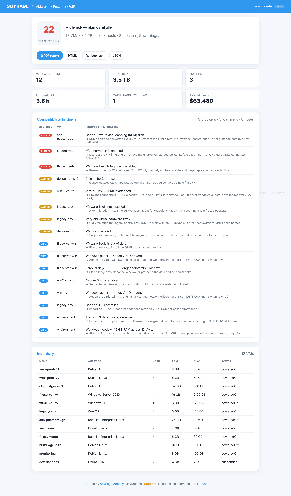
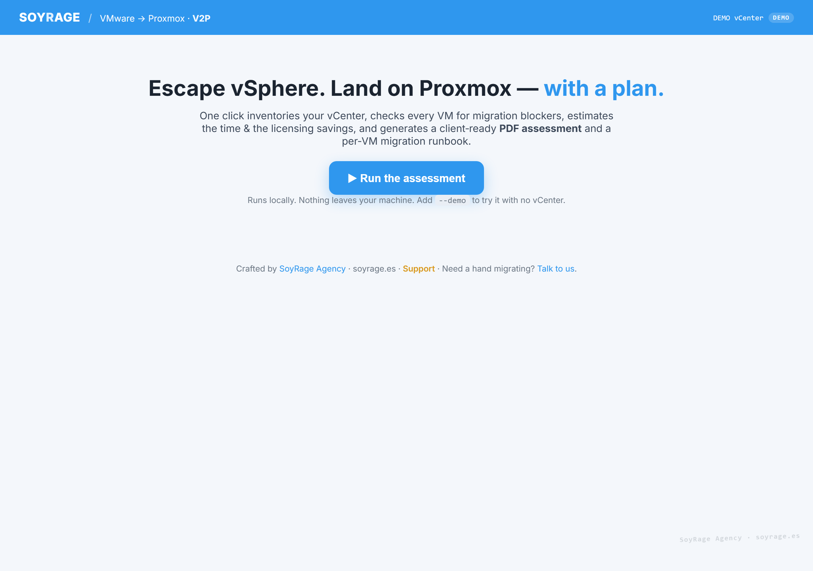
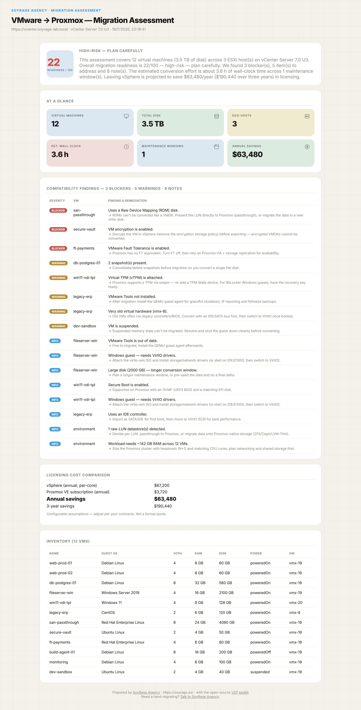

<div align="center">

<a href="https://soyrage.es/">
  
</a>

<br/>

# 🛰️ V2P — VMware → Proxmox Migration Toolkit

**Escape vSphere. Land on Proxmox — with a plan.** Point it at your vCenter and it **inventories** every VM, **checks compatibility**, **estimates the time & the licensing savings**, generates the **disk‑conversion runbook**, and produces a **client‑ready PDF assessment** — all in one click.

*Built for the wave of teams leaving VMware after the Broadcom price hikes.*

<br/>



<sub>🖱️ The one‑click web assessment — readiness score, blockers, cost savings and one‑click PDF / runbook downloads. <a href="#-see-it">More below ↓</a></sub>

<br/><br/>

[](https://github.com/soyrageagency/vmware-to-proxmox/actions/workflows/ci.yml)
[](https://nodejs.org)
[](https://www.typescriptlang.org/)
[](https://www.proxmox.com/)
[](./LICENSE)
[](https://www.paypal.com/paypalme/soyrageagency)

### Designed, built & maintained by **[SoyRage Agency](https://soyrage.es/)** · **https://soyrage.es/**

**⚡ [Try it in one command](#-quick-start-3-ways) · no VMware needed → `--demo`**  ·  **🤝 [We migrate for you](https://soyrage.es/)**

</div>

---

## 📑 Table of contents

- [Quick start (3 ways)](#-quick-start-3-ways)
- [Why this exists](#-why-this-exists)
- [What it does](#-what-it-does)
- [See it](#-see-it)
- [What you get](#-what-you-get-the-assessment-package)
- [How it works](#-how-it-works)
- [Requirements](#-requirements)
- [Install](#-install)
- [vCenter access (read‑only)](#-vcenter-access-read-only)
- [Configuration](#-configuration)
- [Compatibility checks](#-compatibility-checks)
- [Command reference](#-command-reference)
- [Project structure](#-project-structure)
- [Development](#-development)
- [Disclaimer](#-disclaimer)
- [Support & services](#-support--services)
- [Credits & License](#-credits--license)

---

## ⚡ Quick start (3 ways)

You only need [Node.js ≥ 18](https://nodejs.org/) and [Git](https://git-scm.com/). Add **`--demo`** to any command to try it against a realistic fabricated vCenter — **no credentials, no risk.**

**One command (clones, builds, opens the menu):**

<table>
<tr><td><b>🪟 Windows</b></td><td>

```powershell
irm https://raw.githubusercontent.com/soyrageagency/vmware-to-proxmox/main/install.ps1 | iex
```

</td></tr>
<tr><td><b>🍎 macOS / 🐧 Linux</b></td><td>

```bash
curl -fsSL https://raw.githubusercontent.com/soyrageagency/vmware-to-proxmox/main/install.sh | bash
```

</td></tr>
</table>

**Already cloned?** Pick whichever you like — they all do the same thing:

```bash
npm run build

node dist/index.js menu          # 🧭 friendly arrow-key MENU (easiest)
node dist/index.js web --demo    # 🖱️  click-through WEB UI  →  http://127.0.0.1:4700
node dist/index.js assess --demo # ⌨️  full assessment in the TERMINAL → writes the PDF
```

That's it. When you're ready for the real thing, drop the `--demo` and set your vCenter (see [below](#-vcenter-access-read-only)).

---

## 💸 Why this exists

Broadcom's acquisition of VMware turned vSphere into a per‑core subscription and **multiplied bills 2–10×**. Thousands of SMBs and mid‑market shops are actively planning their exit to **Proxmox VE** — but the first question is always the same:

> *“How hard is it, how long will it take, what will break, and how much will we save?”*

**V2P answers that in minutes**, with a document you can put in front of a decision‑maker. It's the assessment that turns *“we should look into leaving VMware”* into *“here's the plan, the cost and the savings.”*

---

## 🧰 What it does

| Stage | What V2P produces |
| --- | --- |
| 🔎 **Inventory** | Connects to vCenter (vSphere REST API) and lists hosts, datastores and every VM — CPU, RAM, disks, guest OS, hardware version, tools, snapshots. |
| 🧪 **Compatibility analysis** | A rules engine flags every migration blocker & gotcha (RDMs, VM encryption, Fault Tolerance, snapshots, vTPM/Secure Boot, missing tools, Windows VirtIO, old hardware…) with concrete **remediations**. |
| ⏱️ **Cost & time estimate** | Per‑VM conversion time, wall‑clock with parallel streams, number of maintenance windows — plus **vSphere‑vs‑Proxmox licensing savings** (annual & 3‑year). |
| 💽 **Disk conversion plan** | A per‑VM Proxmox runbook (`qm create` / `qm importdisk` / `qm set`, VirtIO, vTPM, UEFI) as a **ready‑to‑review `.sh`**. |
| 📄 **PDF assessment** | A branded, **client‑ready PDF** (readiness score, executive summary, findings, savings) — plus a rich HTML version and the raw JSON. |

And you can drive it three ways: **CLI**, an **interactive menu**, or a **click‑through web UI** for non‑technical stakeholders.

---

## 👀 See it

<div align="center">

### The friendly landing — one button


### The client-ready report (HTML / PDF)


<sub>Rendered in <b>demo mode</b> · watermarked © SoyRage Agency · soyrage.es</sub>

</div>

---

## 📦 What you get (the assessment package)

Every `assess` run writes four files to `./assessment/` (configurable):

| File | For whom | Contents |
| --- | --- | --- |
| **`assessment.pdf`** | 👔 The decision‑maker | Readiness score, executive summary, findings, cost comparison — branded, printable. |
| **`assessment.html`** | 🧑‍💻 The engineer | The same, richer and interactive, opens in any browser. |
| **`migration-plan.sh`** | 🛠️ The migrator | Per‑VM Proxmox commands to convert disks and recreate each VM. **Review before running.** |
| **`assessment.json`** | 🤖 Automation | The raw structured data (inventory + findings + estimate + plan). |

---

## 🛠️ How it works

```
   vCenter (vSphere REST API)                 ┌─────────────────────────────┐
            │  read-only                       │   PDF  ·  HTML  ·  plan.sh   │
            ▼                                   │   ·  JSON  ·  web summary    │
   ┌──────────────────┐   inventory   ┌────────┴───────┐   report
   │  V2P vCenter      │ ────────────▶ │  Assessment    │ ─────────▶ 📄
   │  client (+ demo)  │               │  engine        │
   └──────────────────┘               └────────────────┘
                          compatibility · estimate · plan
```

The vCenter client is read‑only and defensive; a built‑in **demo estate** lets the whole pipeline run with no vCenter at all.

---

## ✅ Requirements

| Requirement | Notes |
| --- | --- |
| **Node.js ≥ 18** | ES modules + global `fetch`. |
| **vCenter 7.0+** | For live runs, reachable on `443`, with a **read‑only** account. (Or use `--demo`.) |
| **A browser** | Only for the optional web UI. |

---

## 📥 Install

```bash
git clone https://github.com/soyrageagency/vmware-to-proxmox.git
cd vmware-to-proxmox
npm install
npm run build
node dist/index.js assess --demo   # try it immediately
```

Or use the [one‑command installer](#-quick-start-3-ways).

---

## 🔑 vCenter access (read‑only)

V2P only ever **reads**. Create a dedicated read‑only account:

1. In vCenter: **Administration → Users and Groups → add a user** (e.g. `readonly@vsphere.local`).
2. **Administration → Global Permissions → add**, assign the built‑in **Read‑only** role at the root.
3. Put the details in `.env` (or the environment):
   ```
   VCENTER_HOST=https://vcenter.corp.local
   VCENTER_USER=readonly@vsphere.local
   VCENTER_PASSWORD=•••••••
   VCENTER_VERIFY_TLS=false   # vCenter certs are usually self-signed
   ```

Then run `node dist/index.js assess` (no `--demo`).

---

## ⚙️ Configuration

A local `.env` is loaded automatically. See [`.env.example`](./.env.example).

| Variable | Default | Purpose |
| --- | --- | --- |
| `VCENTER_HOST` | — | vCenter base URL, e.g. `https://vcenter.corp.local`. |
| `VCENTER_USER` / `VCENTER_PASSWORD` | — | Read‑only credentials. |
| `VCENTER_VERIFY_TLS` | `false` | Verify the vCenter certificate. |
| `V2P_DEMO` | `false` | Use the fabricated demo estate (no vCenter). |
| `V2P_OUT_DIR` | `./assessment` | Where the PDF/HTML/plan/JSON are written. |
| `V2P_THROUGHPUT_MBPS` | `250` | Assumed conversion throughput per disk (MB/s). |
| `V2P_PARALLEL` | `2` | VMs migrated in parallel (affects wall‑clock). |
| `V2P_VSPHERE_PER_CORE` | `350` | Annual vSphere cost per core (USD). |
| `V2P_PROXMOX_PER_SOCKET` | `620` | Annual Proxmox subscription per socket (USD). |
| `V2P_WEB_HOST` / `V2P_WEB_PORT` | `127.0.0.1` / `4700` | Web UI bind address. |

> The cost figures are **tunable assumptions**, not a quote — set them to your actual contracts.

---

## 🧪 Compatibility checks

The rules engine currently flags:

- **Blockers** — Raw Device Mappings (RDM), VM encryption, VMware Fault Tolerance.
- **Warnings** — snapshots present, suspended VMs, VMware Tools missing, vTPM, very old virtual hardware.
- **Notes** — Secure Boot, Windows (VirtIO drivers), large disks (window planning), IDE controllers, raw‑LUN storage, cluster sizing.

Each finding includes a **plain‑English remediation**. Contributions of more rules are welcome.

---

## ⌨️ Command reference

```text
v2p assess      run the full assessment → PDF + HTML + runbook + JSON   (default)
v2p inventory   print the discovered vCenter inventory
v2p menu        interactive arrow-key menu
v2p web         launch the click-through web UI
v2p help        show help
                add --demo to any command to use the fabricated estate
```

---

## 🗂️ Project structure

```
vmware-to-proxmox/
├── src/
│   ├── index.ts            # CLI router (assess · inventory · menu · web)
│   ├── branding.ts         # SoyRage identity & ASCII banner
│   ├── config.ts           # env-driven config + assumptions
│   ├── vcenter/
│   │   ├── client.ts        # vSphere REST client (defensive)
│   │   └── demo.ts          # fabricated demo estate
│   ├── core/
│   │   ├── types.ts · assess.ts
│   │   ├── compatibility.ts # rules engine → findings
│   │   ├── estimate.ts      # cost & time
│   │   ├── plan.ts          # per-VM runbook + disk conversion
│   │   └── report.ts        # PDF (pdfkit) + HTML + summary
│   ├── menu/menu.ts         # interactive menu
│   ├── web/                 # server.ts + hand-written SPA (public/)
│   └── utils/format.ts
├── install.sh / install.ps1 · scripts/ · .env.example · LICENSE · README.md
```

---

## 🧑‍💻 Development

```bash
npm run dev        # hot-reload the CLI
npm run typecheck  # strict type-check
npm run build      # compile + copy web assets
npm run smoke      # end-to-end smoke suite (assessment + reports + web)
```

**CI** ([`.github/workflows/ci.yml`](./.github/workflows/ci.yml)) runs type‑check, build and the smoke suite on every push. TypeScript `strict`; every source file carries a SoyRage Agency header.

---

## ⚠️ Disclaimer

V2P produces an **assessment and a draft runbook** to accelerate planning — not a fully automated, unattended migration. **Review the generated `migration-plan.sh`**, adapt the paths/storage to your environment, and validate each VM boots before decommissioning the source. Cost figures are estimates based on configurable assumptions.

---

## 🤝 Support & services

<div align="center">

[](https://www.paypal.com/paypalme/soyrageagency)

**Leaving VMware and want it done right?** [**SoyRage Agency**](https://soyrage.es/) does hands‑on vSphere → Proxmox migrations — assessment, execution and cutover.

**paypal.me/soyrageagency** · a ⭐ on the repo helps too!

</div>

---

## 🧰 More from the SoyRage self‑hosting suite

Once you land on Proxmox, keep the momentum — these open‑source tools share the same design language and safety‑first philosophy:

| Project | What it does |
| --- | --- |
| 🚚 **[VMware → Proxmox Toolkit (V2P)](https://github.com/soyrageagency/vmware-to-proxmox)** | *(you are here)* Inventory vCenter, score compatibility, estimate cost & time, plan disk conversion and export a professional PDF assessment. |
| 🖧 **[Proxmox MCP Server](https://github.com/soyrageagency/proxmox-mcp-server)** | Chat with your fresh Proxmox VE cluster — nodes, VMs & LXC, snapshots and full guest CRUD, plus a tabbed terminal dashboard with an AI command bar. |
| 🐳 **[Docker MCP Server](https://github.com/soyrageagency/docker-mcp-server)** | Chat with your Docker host — containers, logs, Compose, a live web panel and a TUI with an AI copilot. |

---

## 🖋️ Credits & License

<div align="center">

**Designed, built and maintained by [SoyRage Agency](https://soyrage.es/) — https://soyrage.es/**

</div>

Released under the **SoyRage Attribution License** (see [`LICENSE`](./LICENSE) and [`NOTICE`](./NOTICE)). Use, modify and self‑host it — **keep the SoyRage Agency attribution visible** (source headers, generated report footers, the `package.json` author field).

<div align="center">

**© 2026 SoyRage Agency — https://soyrage.es/** · Made with care in Valencia, Spain.

</div>
